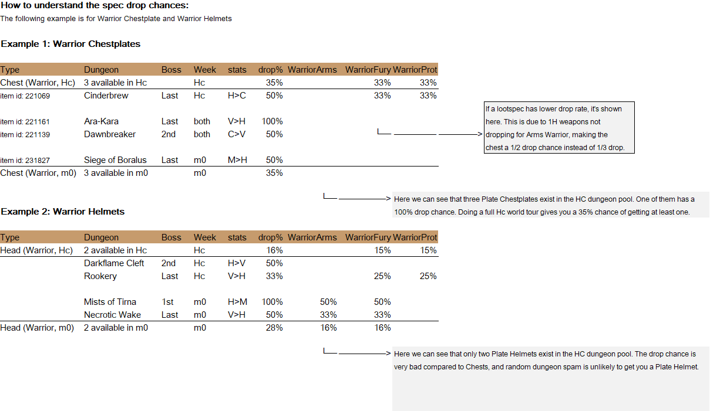

# Gear drop optimizer

This project intended to help players optimize their loot by telling them how likely each type of gear (helmet, gloves, weapon, etc.) was to drop from a given dungeon.

This is quite hard to calculate, as you can only see the full loot table for each boss.  But each boss is part of a dungeon with multiple bosses (that you must also kill), and the actual drop chance of each item depends on the size of the loot table, the loot elligibility of your *and your allies* class/spec.

I copied the final output into a massive spreadsheet with multiple drop chance tables for each gear slot and playable class/spec:
[Google spreadsheet link](https://docs.google.com/spreadsheets/d/1HwX7lmcGNRF1X0eqS8Gbttr7EWLi2pE43eD8ctp9D78/edit?gid=12643874#gid=12643874)

**How the code works:** We input a Wowhead-website link to the most recent dungeon pool. From wowhead, we then scrape: each dungeon, each boss for each dungeon, and each piece of loot from each boss. We then parse out the stats for a given piece of loot (str/agi/int and gear type), which then allows us to reverse-construct what every spec in the game can probabilistically expect to have looted after completing a full dungeon run. And if you are missing any combination of gear (chestplate/trinket/necklace, but NOT a helmet/glove/weapon), the script is also smart enough to calculate which dungeon is statistically most likely to provide a loot upgrade.

